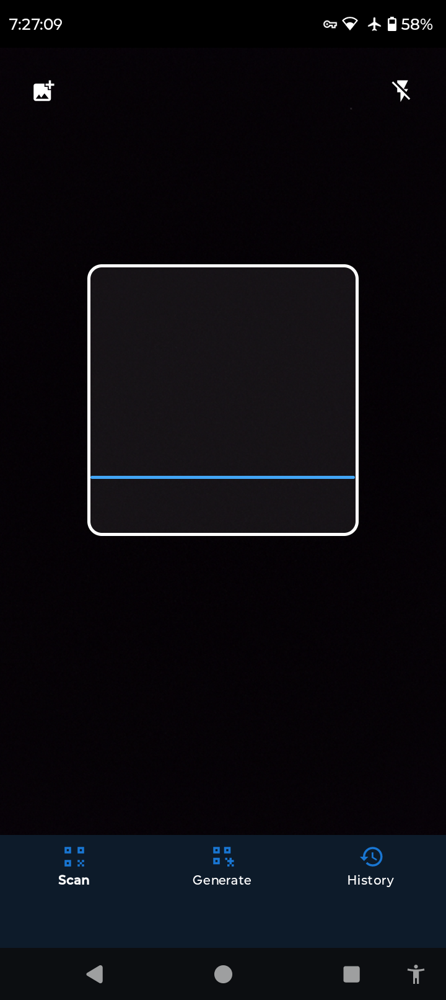
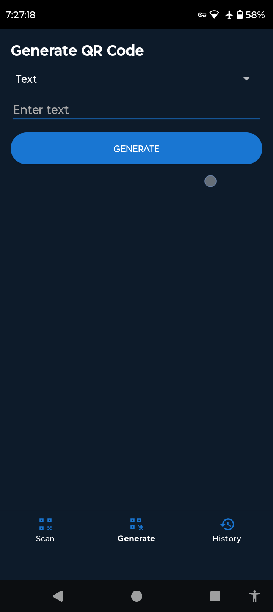
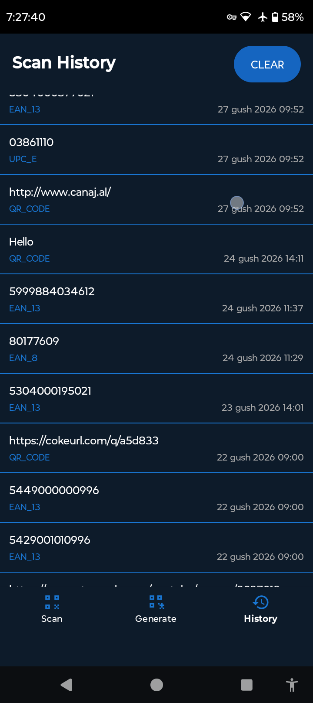

# Privacy QR and Barcode Scanner


A fast, lightweight, and fully offline QR code and barcode scanner for Android. No internet permission. No tracking. No ads.

---
## Latest Version: 1.9

### Changelog

**Version 1.9**
- Fixed typed text not appearing in text fields until the keyboard was closed
- Fixed flashlight/gallery buttons, "Scan History" title and "Clear" button being hidden behind the status bar
- Fixed Copy/Share/Scan Again buttons being partly hidden behind the bottom navigation bar
- General edge-to-edge display fixes

**Version 1.8**
- Privacy: disabled dependency metadata in the release build

**Version 1.7**
- Added flashlight support
- Added tap to focus
- Added pinch to zoom

**Version 1.6**
- Added scan from gallery feature

**Version 1.5**
Major update - Full Offline QR Toolkit!

New features:

QR Code Generator (Text, URL, WiFi, Phone, Email, SMS)
Scan History with Copy, Share and Open options
Bottom navigation for easy access to all features
Renamed to Privacy QR and Barcode Scanner
Improved barcode scanning with multi-format support
All features work 100% offline - no internet permission

**Version 1.3**
-Security Update
- New signing key (previous key was exposed in build config)
- Signing credentials moved to local keystore.properties (not tracked by git)
- Quick Settings Tile improvements
- 
**Version 1.2**
- Added Quick Settings Tile for instant access from notification shade
- Bug fixes and improvements
- 
**Version 1.1**
- Animated scan line
- Smart QR detection (URL, Email, SMS, Phone, WiFi, Location)
- Replaced ML Kit with ZXing (fully open source, no tracking)
- Bug fixes and improvements
- 
## Features

- Scan QR codes and barcodes instantly using your camera
- Fully offline — no internet connection required
- No tracking, no analytics, no ads
- Copy, share, or open scanned results directly
- Open URLs in browser or compatible apps
- Vibration feedback on successful scan
- Clean Material Design UI with dark background
- Supports all major barcode formats (QR, EAN, UPC, Code 128, and more)

---

## Privacy

This app requests only one permission:

- `CAMERA` — required to scan QR codes

No network permission is requested. No data leaves your device. No third-party SDKs with telemetry are active.

---
## Screenshots











## Download

- [GitHub Releases](https://github.com/Laert-Android/Privacy-QR-Scanner/releases)
- [SourceForge](https://sourceforge.net/projects/privacy-qr-scanner)
-  [XdaForums](https://xdaforums.com/t/privacy-qr-scanner-free-open-source-fast-lightweight-and-fully-offline-qr-code-barcode-scanner-for-android-no-tracking-no-ads.4792635)
  - [Appteka](https://appteka.store/app/9dfr321525)
- [F-Droid](https://f-droid.org/sq/packages/com.laert.qrscanner/)

---

## Build

This app is built with Android Studio using Java and Gradle.

**Requirements:**
- Android Studio Hedgehog or newer
- Java 11+
- Android SDK 21+

**Clone and build:**

```bash
git clone https://github.com/Laert-Android/Privacy-QR-And-Barcode-Scanner.git
cd Privacy-QR-And-Barcode-Scanner
.\gradlew assembleRelease
```

---

## Tech Stack

| Component | Library |
|---|---|
| Camera | CameraX 1.3.4 |
| Barcode scanning | ZXing (zxing-android-embedded 4.3.0 / core 3.5.3) |
| UI | Material Components |
| Language | Java |
| Min SDK | Android 5.0 (API 21) |
| Target SDK | Android 15 (API 35) |

---

## License

This project is licensed under the GNU General Public License v3.0 — see the [LICENSE](LICENSE) file for details.

---

## Author

Made by [Laert](https://github.com/Laert-Android)
